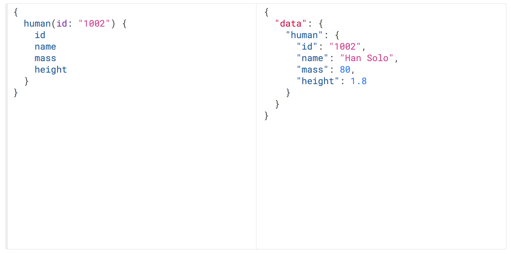
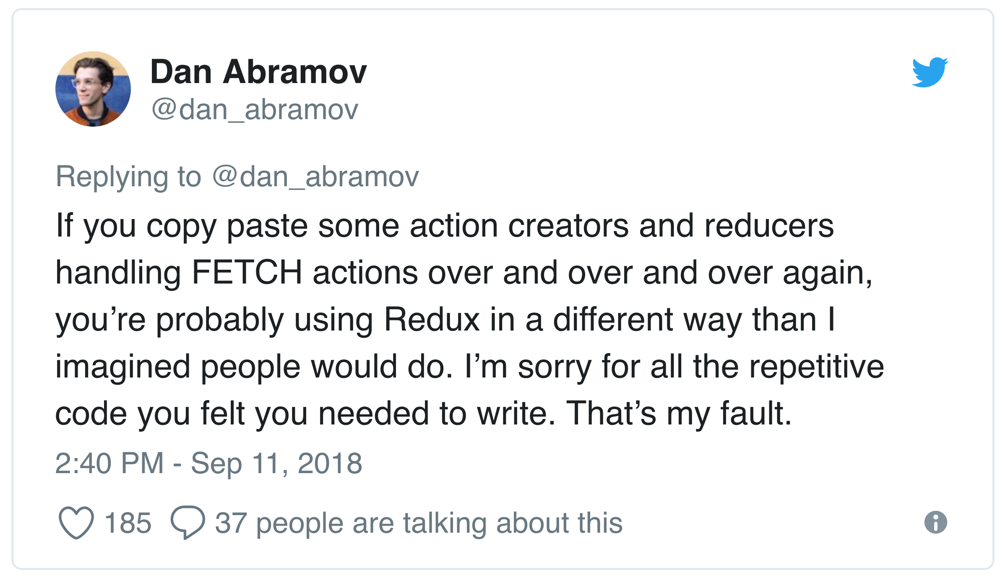

# [fit] GraphQL & React

---

# Chris Toomey

## @christoomey

## @_bikeshed

---

[.build-lists: true]

# A Query Language for your API

^
* Similar to REST & SQL
* Throws out all the normal REST stuff (status codes, verbs, etc)
* JSON w/ a custom query language

---

# You Get What You Ask For

^
* Avoid over / under-fetching
* Client-centric
* Ability to make changes to the server (monitor exactly what fields are used)

---

# Get Related Resources in a Single Query

---

# Schema & Type System

---

# [fit] [GraphiQL Demo](https://developer.github.com/v4/explorer/)

[rest api for user]: https://api.github.com/users/christoomey

---

# [fit] How Does GraphQL Fit with React?

^
comes from a 2017 talk by Cristiano Rastelli called Let There Be Peace On CSS
https://speakerdeck.com/didoo/let-there-be-peace-on-css

---

# [fit] [Sample App Demo](http://localhost:1234/users/)

---

---

# [fit] What, Exactly, _is_ GraphQL?

* [A Specification][]
* Type System
* Query Syntax
* Execution sequence and algorithms (parsing, validation, resolution)
* A reference implementation (GraphQL.js)

[a specification]: http://facebook.github.io/graphql/October2016/

---

Show where it fits in the stack (single route controller instead of typical
many w/ REST API)

Show where it fits in the client <-> server (small amoutn in client, bigger in
server to parse, validate, resolve queries)

---

# [fit] What about Redux?

