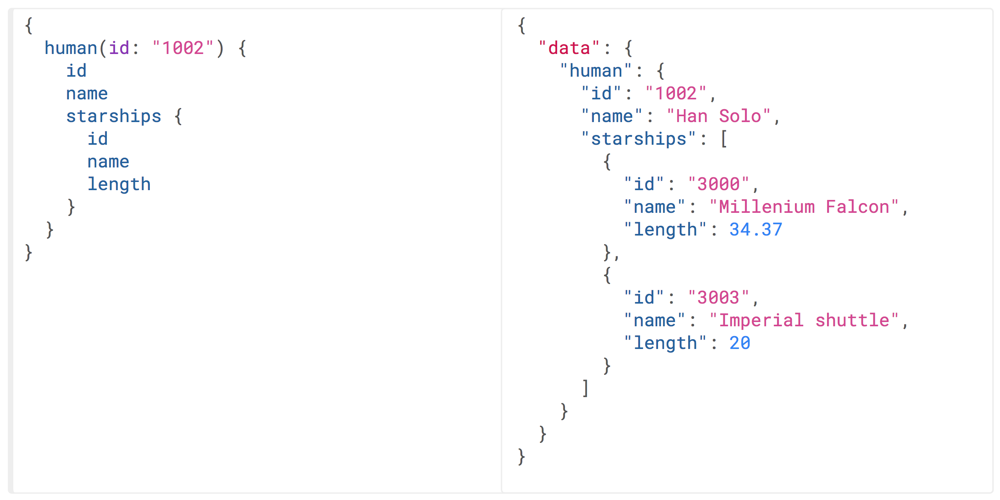
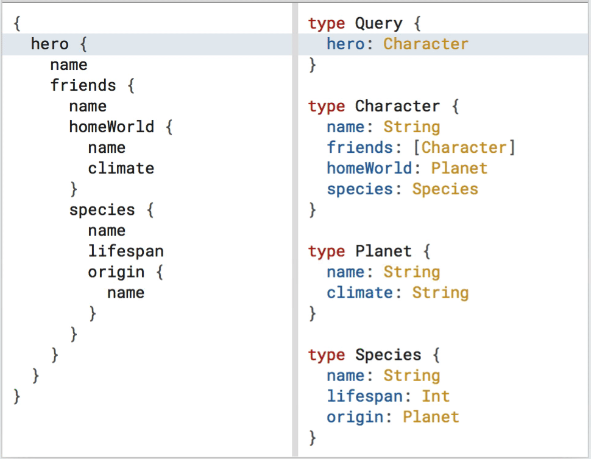
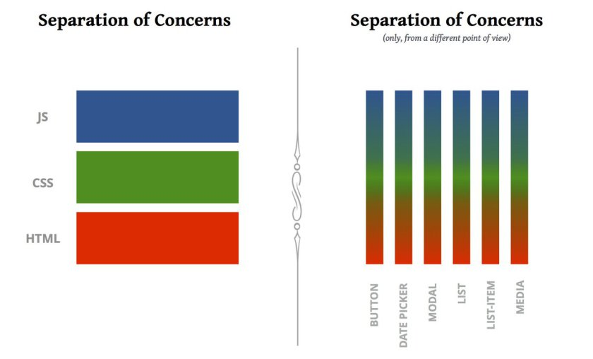
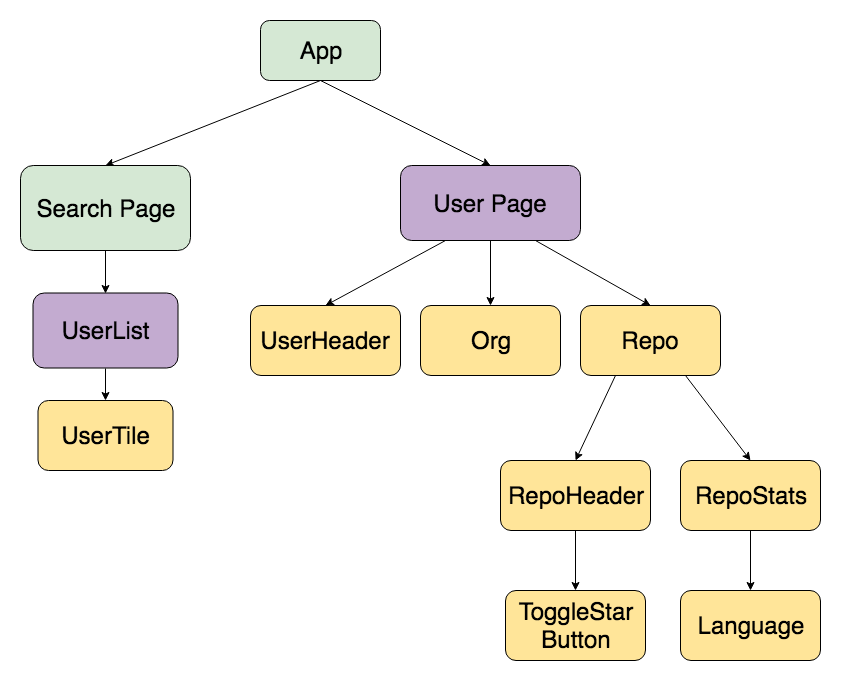

# [fit] GraphQL & React


---

# [fit] GraphQL

### [fit] A Query language for your API

^
- Similar to REST & SQL
- Throws out all the normal REST stuff (status codes, verbs, etc)
- JSON w/ a custom query language

---

# [fit] You Get What You Ask For


^
- Avoid over / under-fetching
- Client-centric
- Ability to make changes to the server (monitor exactly what fields are used)

---

# [fit] Get Related Resources in a Single Query



---

# [fit] Type System - Describe What's Possible



---

# [GraphiQL Demo][]

### [REST API for User][]

[GraphiQL Demo]: https://developer.github.com/v4/explorer/
[REST API for User]: https://api.github.com/users/christoomey

---

# [fit] How Does GraphQL Fit with React?



^
comes from a 2017 talk by Cristiano Rastelli called Let There Be Peace On CSS
https://speakerdeck.com/didoo/let-there-be-peace-on-css

---

### [fit] [Demo Time!](http://localhost:1234/users/)

---



---

```javascript
import React from 'react';
import ReactDOM from 'react-dom';
import ApolloClient from 'apollo-boost';
import {ApolloProvider} from 'react-apollo';
import {BrowserRouter, Route, Switch, Redirect} from 'react-router-dom';
import {SearchPage, UserPage} from './pages';

const client = new ApolloClient({
  uri: 'https://api.github.com/graphql',
  request: async operation => {
    operation.setContext({
      headers: {
        authorization: `Bearer ${process.env.GITHUB_TOKEN}`,
      },
    });
  },
});

const App = () => (
  <ApolloProvider client={client}>
    <BrowserRouter>
      <Switch>
        <Route exact path="/users" component={SearchPage} />
        <Route exact path="/users/:login" component={UserPage} />
        <Redirect from="/" to="/users" />
      </Switch>
    </BrowserRouter>
  </ApolloProvider>
);

ReactDOM.render(<App />, document.getElementById('root'));

// Hot Module Replacement
if (module.hot) {
  module.hot.accept();
}
```

---

```javascript, [.highlight: 8-17,20,28]
import React from 'react';
import ReactDOM from 'react-dom';
import ApolloClient from 'apollo-boost';
import {ApolloProvider} from 'react-apollo';
import {BrowserRouter, Route, Switch, Redirect} from 'react-router-dom';
import {SearchPage, UserPage} from './pages';

const client = new ApolloClient({
  uri: 'https://api.github.com/graphql',
  request: async operation => {
    operation.setContext({
      headers: {
        authorization: `Bearer ${process.env.GITHUB_TOKEN}`,
      },
    });
  },
});

const App = () => (
  <ApolloProvider client={client}>
    <BrowserRouter>
      <Switch>
        <Route exact path="/users" component={SearchPage} />
        <Route exact path="/users/:login" component={UserPage} />
        <Redirect from="/" to="/users" />
      </Switch>
    </BrowserRouter>
  </ApolloProvider>
);

ReactDOM.render(<App />, document.getElementById('root'));

// Hot Module Replacement
if (module.hot) {
  module.hot.accept();
}
```

---

# [fit] What, Exactly, _is_ GraphQL?

- [A Specification][]
- Type System
- Query Syntax
- Execution sequence and algorithms (parsing, validation, resolution)


[A Specification]: http://facebook.github.io/graphql/October2016/

---

Show where it fits in the stack (single route   controller instead of typical
many w/ REST API)

Show where it fits in the client <-> server (small amoutn in client, bigger in
server to parse, validate, resolve queries)
